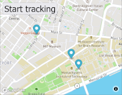

# Real time bus tracker

## Description

Real-time tracking of the location of buses from line 1 in Boston. This is an exercise proposal by Dr. Abel Sanchez (abelsan). In this version, all buses from the line are tracked, this is an improvement on the original exercise that tracked only one bus. In addition, the structure of files was improved.

## How to run

- You need create an account in Mabbox (www.mapbox.com) and to create a token.

- Create a token.js file with this information:

` const token = 'YOUR_TOKEN' `

IMPORTANT: Do not publish your token in repos.

- Open the real-time-bus-tracker.html in navigator.

- Click in the Start Tracking button.

## Roadmap

- Add information to the bus in the point.
- Show the bus station.

## License

### MIT License

Permission is hereby granted, free of charge, to any person obtaining a copy
of this software and associated documentation files (the "Software"), to deal
in the Software without restriction, including without limitation the rights
to use, copy, modify, merge, publish, distribute, sublicense, and/or sell
copies of the Software, and to permit persons to whom the Software is
furnished to do so, subject to the following conditions:

The above copyright notice and this permission notice shall be included in all
copies or substantial portions of the Software.

THE SOFTWARE IS PROVIDED "AS IS", WITHOUT WARRANTY OF ANY KIND, EXPRESS OR
IMPLIED, INCLUDING BUT NOT LIMITED TO THE WARRANTIES OF MERCHANTABILITY,
FITNESS FOR A PARTICULAR PURPOSE AND NONINFRINGEMENT. IN NO EVENT SHALL THE
AUTHORS OR COPYRIGHT HOLDERS BE LIABLE FOR ANY CLAIM, DAMAGES OR OTHER
LIABILITY, WHETHER IN AN ACTION OF CONTRACT, TORT OR OTHERWISE, ARISING FROM,
OUT OF OR IN CONNECTION WITH THE SOFTWARE OR THE USE OR OTHER DEALINGS IN THE
SOFTWARE.
